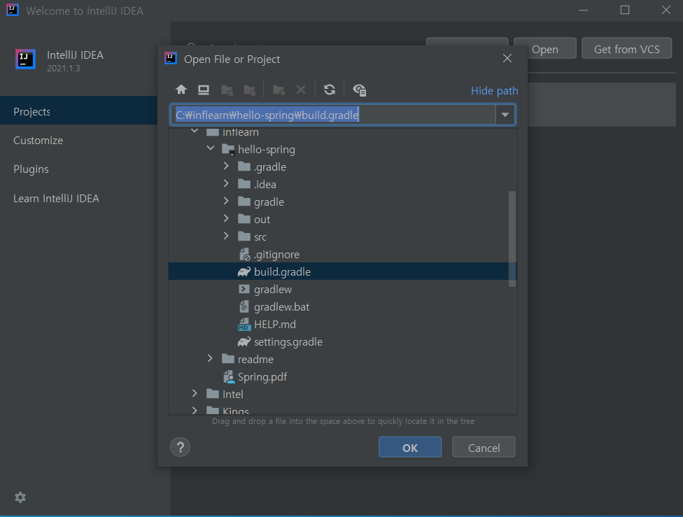
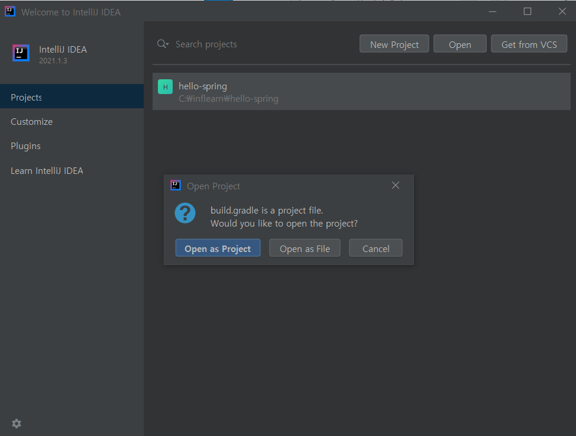
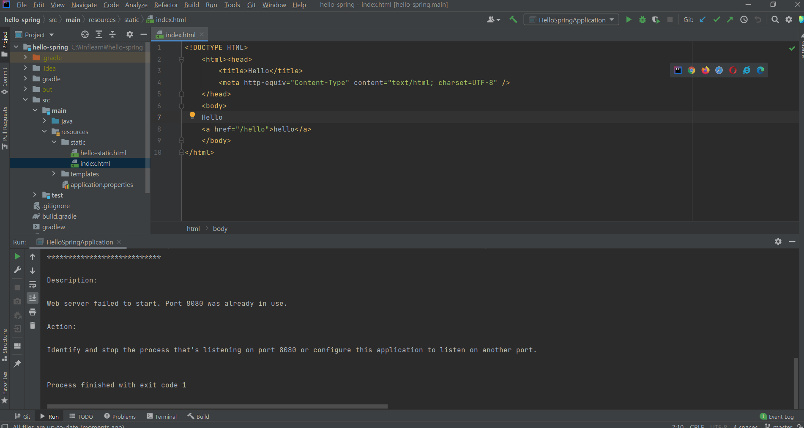
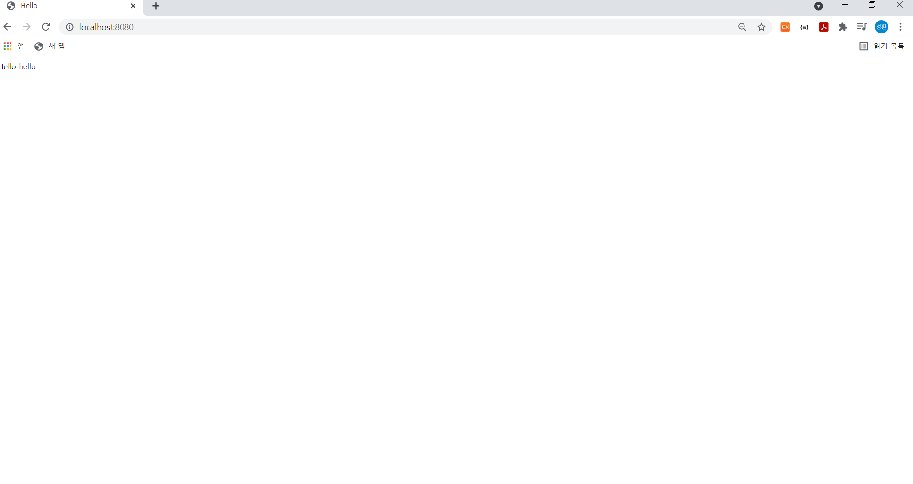

## 프로젝트 시작

- start.spring.io에서 받은 압축파일을 풀어준다.

<br>

- 새 프로젝트를 생성한다.

<br>

- 

>build.gradle을 열어준다.

<br>

- 

>Open as Project 선택

<br>

- 

>index.html을 넣어서 실행해보면 8080 port가 이미 사용중이라고 나온다.
>
>cmd 창을 열어서 관리자 모드로 실행한 뒤에
>
>netstat -ano로 어떤 프로세스가 8080포트를 사용한지 파악한 뒤에
>
>taskkill /f /pid 5380(8080 포트를 사용하는 PID)를 해준다.

<br>

- 정상적으로 실행한 뒤에 localhost:8080으로 접속해본다.



<br>

- index.html

```html
<!DOCTYPE HTML>
    <html><head>
        <title>Hello</title>
        <meta http-equiv="Content-Type" content="text/html; charset=UTF-8" />
    </head>
    <body>
    Hello
    <a href="/hello">hello</a>
    </body>
</html>
```

