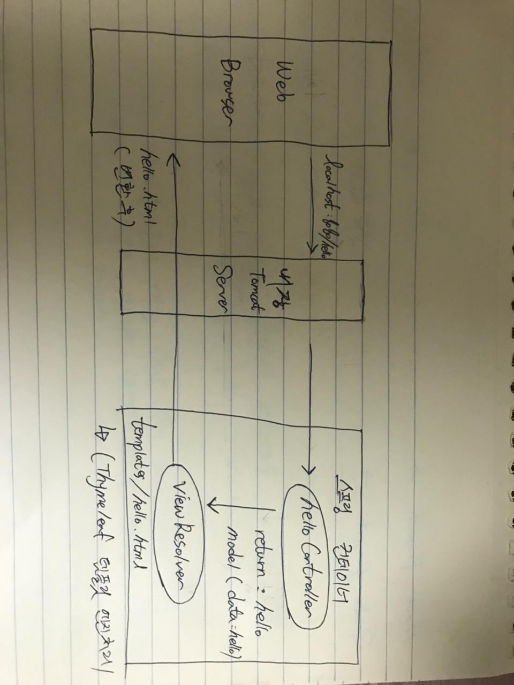

## Package 및 Class 생성

main > java > hello.hellospring > controller(Package 생성) > HelloController(Class 생성)

<br>

```java
// HelloController

package hello.hellospring.controller;

import org.springframework.ui.Model;
import org.springframework.stereotype.Controller;
import org.springframework.web.bind.annotation.GetMapping;

@Controller
public class HelloController {

    @GetMapping("hello")
    public String hello(Model model) {
        model.addAttribute("data", "hello!!");
        return "hello";
    }
}

```

>Controller notation을 적어준다.
>
>@GetMapping("hello")는 클라이언트가 
>
>/hello로 요청 시 아래 hello 함수를 동작하게 해준다.
>
>model.addAttribue는 data라는 객체에 hello!!를 담아서 hello.html에 합쳐준다.
>
>return "hello"가 hello.html와 합치겠다는 의미이다.

<br>

```html
<!-- hello.html -->

<!DOCTYPE HTML>
<html xmlns:th="http://www.thymeleaf.org">
    <head>
        <title>Hello</title>
        <meta http-equiv="Content-Type" content="text/html; charset=UTF-8" />
    </head>
    <body>
    	<p th:text="'안녕하세요. ' + ${data}" >안녕하세요. 손님</p>
    </body>
</html>
```

>HelloController에서 data라는 객체에 value를 담아서 넘겨줬기 떄문에 
>
>data에는 hello!!가 들어가게 된다

<br>

<Br>

## 동작 환경 그림



>- 웹 브라우저에서 localhost:8080/hello에 GET 방식으로 요청을 보낸다.
>
>- 서버가 이를 감지해서 GetMapping을 통해 
>
>  hello 페이지에서 요청이 올 시에 실행할 함수를 찾는다.
>
>- Controller에서 리턴 값으로 문자를 반환하면 뷰 리졸버가 화면을 찾아서 처리한다.
>
>  - 스프링 부트 템플릿엔진 기본 viewName 매핑
>    - resources:templates/ + (ViewName) + .html
>
>- spring-boot-devtools 라이브러리를 추가하면, 
>
>  html 파일을 컴파일만 해주면 서버 재시작 없이 View 파일 변경이 가능하다.
>
>  IntelliJ 컴파일 방법 : 메뉴 build -> Recompile
>
>- templates에서 hello.html을 찾아서 화면에 보여준다.