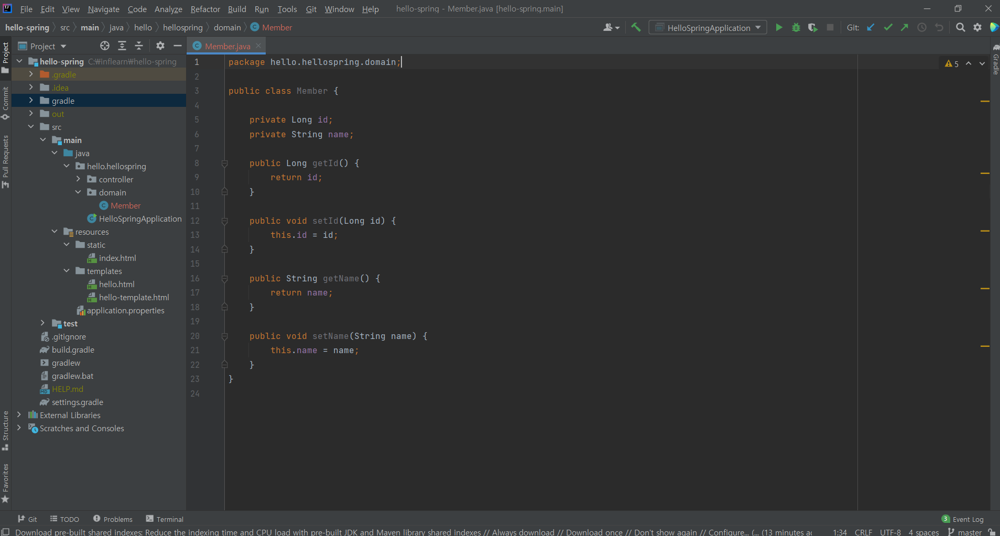
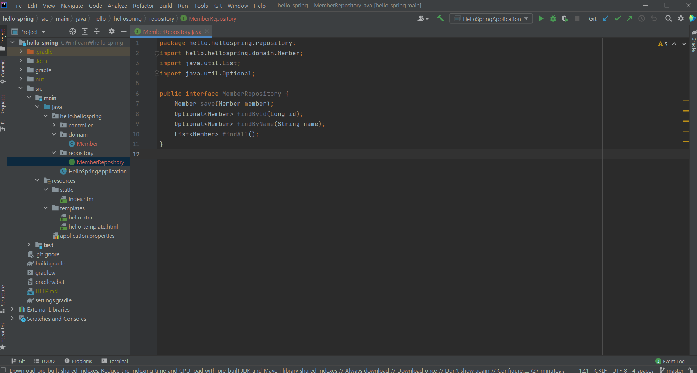

## domain 만들기

>domain package를 만들어서
>
>그 아래 member class를 만들어준다.
>
>id는 회원을 구분할 pk 값으로 쓰이고
>
>name은 회원 id를 의미한다.
>
>회원정보를 넣어주고 받아올 getter setter를 만들어준다.
>
> 
>
>>Getter와 Setter
>>
>>객체 지향 프로그래밍에서는 객체의 필드를 객체 외부에서 직접적으로 접근하는 것을 막는다.
>>
>>외부에서 마음대로 변경할 경우 객체의 무결성(정확하고 안정적임)이 깨질 수 있기 때문이다.
>>
>>이러한 문제점을 방지하고자 메소드를 통해서 필드를 변경하는 방법을 선호한다.
>>
>>이 경우 메소드는 매개값을 검증해서 유효한 값만 객체의 필드로 저장할 수 있게 한다.
>>
>>예를 들면 자동차의 속도는 음수가 될 수 없는데, 음수로 바꾸면 안되기 떄문에 음수 인지 아닌지 검증 절차를 메소드에서 거치게 하도록 구성할 수 있다.
>>
>> 
>>
>>객체의 필드를 읽을 때도 메서드를 사용하는 것이 좋다. 필드 값을 직접 사용하면 부적절하고 적당히 가공해서 사용해야 할수도 있기 떄문이다. 적절한 가공이 필요할 경우 Getter 메소드가 그 역할을 한다.

 

 

## Repository 만들기

>Optional은 id나 name 값이 Null일 때, Null을 Optional로 감싸서 반환하는 방법이다. Java8에 들어있는 기능
>
>Repository의 4가지 기능을 만들었다.
>
>save(Member member)은 member가 저장소에 저장되는 것이다.
>
>findByI(Long id)는 id로 회원을 찾는 것이다.
>
>findByName(String name)은 name로 회원을 찾는다.
>
>findAll()은 모든 회원정보를 반환한다.
>
> 
>
>>Interface
>>
>>인터페이스는 개발 코드와 객체가 서로 통신하는 접점 역할을 한다.
>>
>>개발 코드가 인터페이스의 메소드를 호출하면 인터페이스는 객체의 메소드를 호출시킨다.
>>
>>그렇기 때문에 개발 코드는 객체의 내부 구조를 알 필요가 없고 인터페이스의 메소드만 알고 있으면 된다.
>>
>>개발 코드가 직접 객체의 메소드를 호출하면 간단한데 왜? 중간에 인터페이스를 둘까?
>>
>>그 이유는 개발코드를 수정하지 않고 사용하는 객체를 변경할 수 있도록 하기 위해서이다.
>>
>>인터페이스는 하나의 객체가 아니라 여러 객체들과 사용이 가능하므로 
>>
>>어떤 객체를 사용하느냐에 따라서 실행 내용과 리턴 값이 다를 수 있다.
>>
>>따라서 개발 코드 측면에서 코드 변경 없이 실행 내용과 리턴 값을 다양화 할 수 있다는 장점을 가지게 된다.

 

 

## 구현체 만들기

>MemberRepository 인터페이스를 implements를 한다.
>
>implements는 interface를 구현하는 것이다. 
>
>부모 객체는 선언만 하고 정의는 자식에서 오버라이딩해서 사용한다.
>
> 
>
>save를 할 때 저장할 공간을 store로 정의한다.
>
>Map을 사용하는데 key는 회원의 id니까 Long으로 하고 값은 Member로 한다.
>
>HashMap은 동시성의 문제가 있을 수 있어서, 
>
>공유되는 변수일 때는 concurrentHashMap을 사용한다.
>
> 
>
>>HashMap과 concurrentHashMap
>>
>>>HashMap은 주요 메소드에 synchronized 키워드가 없고, key value에 null을 입력할 수 있다.
>>>
>>>synchronized 키워드가 존재하지 않아서 
>>>
>>>Map 인터페이스를 구현한 클래스 중에서 성능이 제일 좋지만, 
>>>
>>>synchronized 키워드가 존재하지 않기 때문에 
>>>
>>>당연히 Multi-Thread 환경에서 사용할 수 없는 특징을 가지고 있다.
>>>
>>> 
>>>
>>>ConcurrentHashMap은 HashMap을 thread-safe 하도록 만든 클래스이다.
>>>
>>>하지만 HashMap과는 다르게 key value에 null을 허용하지 않는다. 또한 putIfAbsent라는 메소드를 가지고 있는데 키 값이 존재하면 기존의 값을 반환하고, 없다면 입력한 값을 저장한 뒤 반환한다.
>>>
>>>synchronized 키워드가 메소드 전체에 붙어 있지 않고. 
>>>
>>>put()메소드에는 중간에만 synchronized 키워드가 존재한다.
>>>
>>>이것을 정리하면 읽기 작업에는 여러 쓰레드가 동시에 읽을 수 있지만, 
>>>
>>>쓰기 작업에는 특정 세그먼트 or 버킷에 대한 Lock을 사용한다는 것이다.
>>>
>>>DEFAULT_CAPACITY는 버킷의 수이고, 
>>>
>>>DEFAULT_CONCURRENCY_LEVEL은 동시에 작업이 가능한 쓰레드 수이다.
>>>
>>>버킷의 수가 동시 작업 가능한 쓰레드 수인 이유는 
>>>
>>>ConcurrentHashMap은 버킷 단위로 lock을 사용하기 때문에
>>>
>>>같은 버킷만 아니라면 Lock 기다릴 필요가 없다는 특징이 있다.
>>>
>>>즉, 여러 쓰레드에서 ConcurrentHashMap 객체에 동시에 데이터를 삽입, 참조하더라도
>>>
>>>그 데이터가 다른 세그먼트에 위치하면 서로 lock을 얻기 위해 경쟁하지 않는다.
>>>
>>>일단 이렇게 알고 넘어가자.
>
> 
>
>sequence는 0, 1, 2와 같이 하나씩 증가하는 key 값을 생성해주는데, long 보다는 
>
>동시성 문제를 고려하여 AtomicLong을 사용해야한다.
>
>setId를 할 때 sequence 값을 하나 올려주고,
>
>store에 넣어주고 member를 return 해준다.
>
> 
>
>findById는 store.get(id)를 하는데 만약 id가 없다면? Null이 반환될 수있다.
>
>이 경우를 대비해서 Optional로 감싼다.
>
>감싸서 반환해주면 클라이언트에서 어떤 동작을 취할 수 있다.
>
> 
>
>findByName은 반복을 돌리면서 member에서 getName()을 했을 때, 
>
>parameter에서 넘어온 name하고 같은지 확인하고 하나라도 있으면
>
>반환하고, 없으면 Optional에 null이 포함돼서 반환된다.
>
> 
>
>findAll()은 store의 values들을 반환해주면 된다.