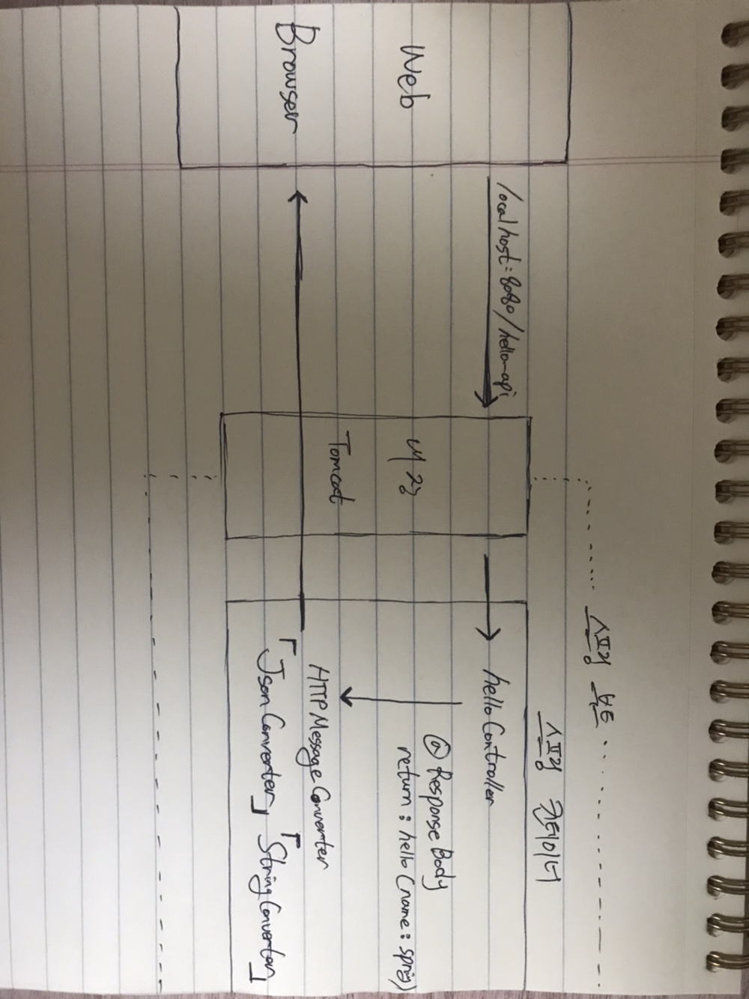

## 스프링 웹 개발 기초

- 정적 컨텐츠

  - 서버에서 특별한 변형 없이 요청에 맞는 파일을 그대로 보내준다.

- MVC와 템플릿 엔진

  - MVC패턴을 활용하여 JSP, PHP와 같은 템플릿 엔진으로 

    서버에서 프로그래밍을 통해 HTML을 동적으로 바꾸는 것

- API

  - 서버에서 JSON 데이터 포맷으로 클라이언트가 요청한 데이터를 전달한다.

    Vue나 React와 같이 활용하거나 서버끼리 통신할 때 주로 활용한다.

<br>

#### Parameter 넘기기

```java
// HelloController.java

package hello.hellospring.controller;

import org.springframework.ui.Model;
import org.springframework.stereotype.Controller;
import org.springframework.web.bind.annotation.GetMapping;
import org.springframework.web.bind.annotation.RequestParam;

@Controller
public class HelloController {

    @GetMapping("hello-mvc")
    public String helloMvc(@RequestParam("name") String name, Model model) {
        model.addAttribute("name", name);
        return "hello-template";
    }
}
```

>helloMvc라는 메서드는 name이라는 키로 값을 필수적으로 받아야 한다.
>
>RequestParam의 파라미터에 required = false 처리를 해줄 경우 안넣어도 되지만
>
>이 경우에는 name에 null 값이 넘어가게 된다. 
>
>localhost:8080/hello-mvc?name=gg 와 같이 name에 값을 넘겨주면
>
>String name으로 gg가 전달 되고 이 gg는 name이라는 키로 
>
>다시 hello-template에서 합쳐지게 된다.

<br>

#### API

```java
package hello.hellospring.controller;

import org.springframework.ui.Model;
import org.springframework.stereotype.Controller;
import org.springframework.web.bind.annotation.GetMapping;
import org.springframework.web.bind.annotation.RequestParam;
import org.springframework.web.bind.annotation.ResponseBody;

@Controller
public class HelloController {

    @GetMapping("hello-api")
    @ResponseBody
    public Hello helloApi(@RequestParam("name") String name){
        Hello hello = new Hello();
        hello.setName(name);
        return hello;
    }

    static class Hello {
        private String name;

        public String getName() {
            return name;
        }

        public void setName(String name) {
            this.name = name;
        }
    }
}
```

>Json 형식으로 key와 value를 넘겨 줄 때 활용된다.
>
>@ResponseBody는 응답하는 Body 부분에 데이터를 직접 넣어주겠다는 의미이다.
>
>객체를 만들어서 넘겨주기 위해서 Hello Class를 생성해준다.
>
>name을 키로 받아온 값을 받아서 hello 객체의 name 속성에 할당해준다.
>
>hello 객체를 리턴해준다.

<br>

#### @ResponseBody

HTTP의 BODY에 문자 내용을 직접 반환

viewResolver 대신에 HttpMessageConverter가 동작

기본 문자 처리 : StringHttpMessageConverter

기본 객체 처리 : MappingJackson2HttpMessageConverter

byte 처리 등등 기타 여러 HttpMessageConverter가 기본으로 등록되어 있음

<br>

#### ResponseBody 사용 원리



>객체가 오면 기본 Default가 JSON 방식으로 데이터를 만들어서 응답하겠다.
>
>기존에는 viewResolver가 동작했으나, @ResponseBody로 인해 HttpMessageConverter가 동작
>
>return 값이 String이면 StringConverter가 동작을 하고
>
>객체일 경우 JsonConverter가 동작을 한다.
>
>객체를 Json으로 바꿔주는 라이브러리는 Jackson이다.


